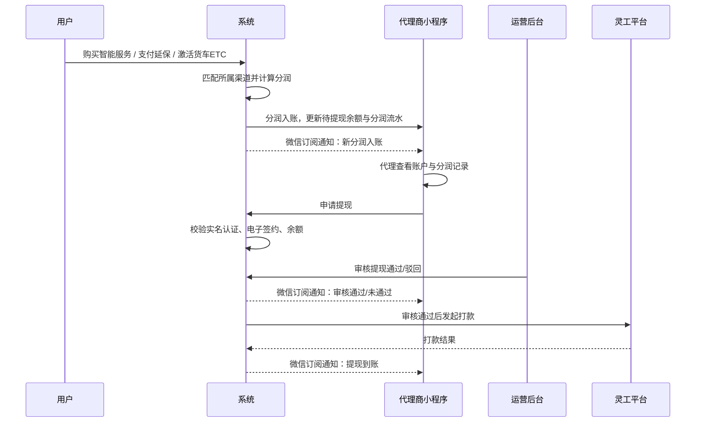

# 代理渠道延保分润系统 MVP 产品需求文档

## 前置待确认项

| 编号  | 待确认项                                 | 影响范围              |
| --- | ------------------------------------ | ----------------- |
| Q1  | 灵工平台电子签约 H5 / 小程序的正式跳转地址、回调方式、状态查询接口 | 认证签约、提现前置校验       |
| Q2  | 微信订阅通知模板 ID、订阅授权入口、失败重试策略            | 分润入账、提现审核、提现到账通知  |
| Q3  | 退款成功后同步至用户小程序的具体页面与字段                | 退款规则、小程序订单详情      |
| Q4  | 分润结算周期、提现批次、打款到账状态回传机制               | 账户余额、提现记录、退款已提现判断 |
| Q5  | 渠道管理中销售人员下拉数据来源与在职状态同步规则             | 渠道管理新增/修改弹窗       |

## 一、基本信息

| 项目    | 内容               |
| ----- | ---------------- |
| 所属业务  | 代理渠道延保分润系统       |
| 当前版本  | MVP v1.0         |
| 需求优先级 | P0               |
| 需求负责人 | [待确认]            |
| 原型文件  | `mvp.html`       |
| 适用端   | 代理商小程序、运营 Web 后台 |

## 二、版本管理

| 版本       | 修订内容                                              | 修订人    | 修订时间       |
| -------- | ------------------------------------------------- | ------ | ---------- |
| MVP v1.0 | 按当前原型整理完整 PRD，覆盖登录、账户、分润、我的、渠道管理、提现审核、退款规则、微信订阅通知 | Cursor | 2026-04-29 |

## 三、需求背景

### 3.1 平台定位

代理渠道延保分润系统用于支撑记录仪智能服务、客车 ETC 延保、货车 ETC 激活三类业务的渠道分润。系统需要完成“渠道配置 → 分润入账 → 代理查看 → 认证签约 → 申请提现 → 运营审核 → 打款/退款联动”的最小闭环。

### 3.2 背景与问题

当前代理渠道分润涉及多产品、多渠道、多结算状态。MVP 需要先解决核心问题：

- 代理商需要在小程序查看待提现余额、分润流水、提现记录。
- 运营需要在后台维护渠道分润规则，并对敏感配置进行审核码校验。
- 代理提现前必须完成实名认证与电子签约。
- 退款时需要识别分润是否已提现，避免线上退款与已打款分润产生资金风险。

### 3.3 核心商业逻辑

用户购买智能服务 / 延保订单支付 / 货车 ETC 设备激活 → 系统匹配所属渠道 → 按配置计算分润 → 分润进入代理待提现余额 → 代理完成认证签约后申请提现 → 运营审核通过并打款 → 退款时按分润是否已提现决定线上或线下处理。

### 3.4 业务价值

- 建立代理渠道分润闭环，支撑多产品渠道激励。
- 降低人工核算和线下对账成本。
- 通过系统审核码简化 MVP 审核流程，保障敏感配置变更可控。
- 通过退款联动规则降低资金倒挂风险。

### 3.5 用户价值

- 代理商可实时查看分润、余额、提现记录，提升结算透明度。
- 运营可集中维护渠道分润规则、审核提现、处理退款。
- 系统可通过微信订阅通知及时告知分润入账与提现状态。

## 四、目标与成功指标

### 4.1 阶段目标

MVP 阶段完成代理分润最小闭环：

1. 支持三条分润链路入账：记录仪、客车 ETC、货车 ETC。
2. 支持代理登录、账户余额、分润流水、我的认证签约。
3. 支持提现申请前置校验与运营审核。
4. 支持渠道管理分润配置与 4 位系统审核码校验。
5. 支持退款三分支判断与小程序分润流水同步。

### 4.2 成功指标

| 指标        | 目标                              |
| --------- | ------------------------------- |
| 分润入账准确率   | 记录仪 / 客车 ETC / 货车 ETC 分润计算与配置一致 |
| 提现前置拦截准确率 | 未认证、未签约、余额不足均可正确弹窗拦截            |
| 渠道配置审核覆盖率 | 敏感字段填写或变更时 100% 触发 4 位系统审核码     |
| 退款分支命中准确率 | 不参与分润、分润未提现、分润已提现三类处理方式正确       |
| 原型一致性     | PRD、原型页面、原型内需求描述保持一致            |

## 五、待办事项与时间规划

| 待办事项                 | 负责人   | 完成时间  |
| -------------------- | ----- | ----- |
| 确认灵工平台签约接口与回调        | [待确认] | [待确认] |
| 确认微信订阅通知模板           | [待确认] | [待确认] |
| 确认渠道管理字段与后台接口        | [待确认] | [待确认] |
| 确认退款判断所需订单/分润/提现关联数据 | [待确认] | [待确认] |
| 完成 MVP 联调与验收         | [待确认] | [待确认] |

## 六、整体业务流程

### 6.1 主路径：分润入账到提现

### 6.2 辅助路径：渠道配置与审核码

运营在渠道管理中新增或修改渠道信息。若填写或变更敏感字段，系统直接在新增/修改弹窗上方弹出 4 位系统审核码弹窗；验证通过后变更立即生效。

敏感字段包括：

- 代理商电话（分润不为空时）
- 智能服务分润比例
- 延保分润比例
- 货车分润金额（轻卡、重卡、牵引车任一有值）

### 6.3 辅助路径：退款规则

运营在套餐订单记录或延保服务订单列表点击退款时，系统判断分润状态：

1. 不参与分润：直接退款，代理可提现余额不变。
2. 参与分润且未提现：直接退款，扣减代理可提现余额，小程序分润流水新增退款扣回记录。
3. 参与分润且已提现：不可自动退款，提示运营线下通知代理商处理。

## 七、用户故事

| 角色  | 用户故事                                       |
| --- | ------------------------------------------ |
| 代理商 | 作为代理商，我希望登录小程序后看到待提现余额、累计分润和提现记录，以便了解收益情况。 |
| 代理商 | 作为代理商，我希望查看分润记录及各业务类型分润金额，以便核对分润来源。        |
| 代理商 | 作为代理商，我希望完成实名认证和电子签约后申请提现，以便合规收款。          |
| 运营  | 作为运营，我希望维护渠道分润配置，并通过系统审核码校验敏感字段，以便保障配置安全。  |
| 运营  | 作为运营，我希望审核代理提现申请，并在未认证或未签约时被系统拦截，以便降低付款风险。 |
| 运营  | 作为运营，我希望退款时系统按分润状态给出处理方式，以便避免已提现分润造成资金风险。  |

## 八、竞品分析

### 8.1 竞品结论

[待确认]。本 PRD 当前以现有原型和业务规则为准，未引入外部竞品结论。

### 8.2 竞品方案汇总

[待确认]。

## 九、需求范围

### 9.1 本次提供

| 模块          | 说明                               | 端      | 优先级 |
| ----------- | -------------------------------- | ------ | --- |
| 登录页         | 手机号 + 短信验证码登录，手机号需与渠道管理代理商电话一致   | 代理商小程序 | P0  |
| 账户 Tab      | 待提现余额、累计分润、已提现、提现金额输入、申请提现、提现记录  | 代理商小程序 | P0  |
| 分润 Tab      | 分润记录、代理商名称、本月分润记录汇总、分类分润金额、分润流水  | 代理商小程序 | P0  |
| 我的 Tab      | 渠道资料、用户协议、隐私协议、认证/签约状态与入口        | 代理商小程序 | P0  |
| 实名认证 + 电子签约 | 姓名、开户行、银行卡号、身份证号、身份证正反面；签约对接灵工平台 | 代理商小程序 | P0  |
| 微信订阅通知      | 分润入账、提现审核通过、提现审核未通过、提现到账         | 代理商小程序 | P1  |
| 渠道管理        | 渠道列表、激活绑定率、分润金额、销售人员、修改弹窗、4 位审核码 | 运营后台   | P0  |
| 提现审核        | 运营审核通过/驳回，校验认证签约状态               | 运营后台   | P0  |
| 退款规则        | 三分支退款判断与弹窗                       | 运营后台   | P0  |

### 9.2 本次不涉及

| 模块               | 说明                    |
| ---------------- | --------------------- |
| 主管 / 销售小程序视图     | 二期支持，MVP 权限暂不区分       |
| 门店管理（专属二维码）      | 二期支持，MVP 阶段门店管理页面暂不开放 |
| 角色权限隔离（RBAC）     | 二期支持                  |
| 货车 ETC 门店专属码扫码绑定 | 二期支持；MVP 以渠道配置自动匹配为准  |

## 十、产品规划

### 10.1 MVP 阶段

完成代理分润与提现闭环，覆盖渠道配置、分润入账、代理查看、认证签约、提现审核、退款联动。

### 10.2 二期规划

- 主管 / 销售小程序视图。
- 门店管理与门店专属二维码。
- 货车 ETC 门店专属码扫码绑定渠道。
- 完整 RBAC 权限隔离。
- 更复杂的多人审批流。

## 十一、功能详情

### 11.1 功能清单

| 功能    | 说明                                   |
| ----- | ------------------------------------ |
| 手机号登录 | 手机号 + 短信验证码，模板 ID：176380，签名 ID：28681 |
| 账户余额  | 展示待提现余额、累计分润、已提现                     |
| 申请提现  | 直接校验认证、签约、余额，不再二次输入提现金额              |
| 分润记录  | 展示分润流水和退款扣回流水                        |
| 认证签约  | 枚举未认证未签约、已认证未签约、已认证已签约三种状态           |
| 渠道管理  | 列表展示新增字段，弹窗配置分润规则                    |
| 系统审核码 | 4 位审核码，演示码 MVP0                      |
| 提现审核  | 运营审核通过/驳回                            |
| 退款规则  | 不参与分润、分润未提现、分润已提现三分支                 |

### 11.2 登录页

| 规则     | 说明                              |
| ------ | ------------------------------- |
| 登录方式   | 手机号 + 短信验证码                     |
| 号码校验   | 手机号需与渠道管理中代理商电话一致，且已通过系统审核码验证生效 |
| 未绑定手机号 | 提示“该手机号未绑定任何渠道，请联系运营配置”         |
| 验证码    | 有效期 5 分钟，60 秒后可重新获取             |
| 登录后跳转  | 代理商账户首页                         |
| 协议入口    | 登录页展示“登录即代表同意用户协议与隐私政策”；“用户协议”“隐私政策”均可点击打开对应协议正文页面 |
| 协议正文    | 协议正文页面内容基于当前用户协议和隐私政策文本，作为小程序内独立页面展示。 |

### 11.3 账户 Tab

余额卡展示：

- 账户页右上角铃铛作为消息通知入口，可点击查看分润入账、提现审核通过/未通过等消息。

- 待提现余额 = 累计分润入账 − 累计已提现。
- 累计分润：记录仪、客车 ETC、货车 ETC 已结算入账分润总额。
- 已提现：所有审核通过并到账的提现金额累计。

申请提现前置校验：

| 顺序  | 场景    | 弹窗文案                                            |
| --- | ----- | ----------------------------------------------- |
| 1   | 未实名认证 | “尚未完成实名认证，请前往「我的 → 认证/签约」完成实名认证后再申请提现”，含“去认证”按钮 |
| 2   | 未完成签约 | “尚未完成电子签约，认证已通过，还需完成电子签约后方可提现”，含“去签约”按钮         |
| 3   | 余额不足  | “提现金额超出余额，最多可提现 ¥XXX，请修改金额后重试”                  |

提现记录：

- 默认展示全部提现记录。
- 状态包括：审核中（橙）、审核通过（绿）、已驳回（红，附驳回原因）。
- 列表文案不展示“灵工平台”。
- 审核通过和审核中记录不展示“已打款至尾号银行卡”“运营审核中”等描述文案；已驳回记录展示驳回原因。

### 11.4 分润 Tab

页面顶部：

- 第一行：分润记录。
- 第二行：代理商名称，如“黄石新捷顺名车”。

顶部汇总：

- 分润笔数。
- 本月分润。
- 退款订单。

分类汇总：

- 记录仪智能服务：展示对应分润金额。
- 货车 ETC 设备激活：展示对应分润金额。
- 客车 ETC 延保：展示对应分润金额。
- 仅展示，不支持点击筛选。

分润流水：

- 默认展示全部分润记录。
- 包含记录仪智能服务、货车 ETC 设备激活、客车 ETC 延保、退款扣回。
- 正向分润显示“+¥金额”。
- 退款扣回显示“−¥金额”，并标注“分润已扣回”。
- 按发生时间倒序。

### 11.5 我的 Tab 与认证签约

个人资料：

- 渠道名称。
- 登录手机号脱敏展示。
- 用户协议、隐私协议可点击。

认证/签约状态：

| 状态        | 展示             |
| --------- | -------------- |
| 未认证 · 未签约 | 展示认证入口，认证表单为空  |
| 已认证 · 未签约 | 展示已认证信息，支持前往签约 |
| 已认证 · 已签约 | 展示认证信息与签约完成状态  |

实名认证字段：

- 姓名。
- 开户行。
- 银行卡号。
- 身份证号。
- 身份证正反面照片。

认证后可修改：

- 开户行、银行卡号在认证/签约后仍可编辑，提交后生效。
- 姓名、身份证号认证后只读。

电子签约：

- 点击“前往灵工平台签约 →”跳转灵工平台 H5 / 小程序。
- 签约完成后返回小程序，点击“我已完成签约”，系统查询灵工状态并更新为已签约。

### 11.6 分润链路

| 产品     | 触发时机        | 匹配方式                      | 分润计算                |
| ------ | ----------- | ------------------------- | ------------------- |
| 记录仪    | 用户购买智能服务订单  | 系统通过设备 IMEI 查找所属渠道        | 命中后按智能服务分润比例入账      |
| 客车 ETC | 延保订单支付成功    | 系统通过设备 SN 号查找所属渠道         | 命中后按延保金额 × 延保分润比例入账 |
| 货车 ETC | 设备激活时匹配所属渠道 | 系统通过渠道配置自动匹配；门店专属码扫码绑定为二期 | 按车型档位金额（轻卡/重卡/牵引）入账 |

### 11.7 渠道管理

列表页：

- 筛选项新增按总设备激活绑定率排序（高→低 / 低→高）。
- 列表不展示负责人联系方式、分润比例、备注。
- 新增字段：总激活绑定率、记录仪绑定率、客车 ETC 激活率、货车 ETC 激活率、分润金额、销售人员姓名。
- 绑定率格式：“XX%（激活数/进货数）”；不涉及该产品的渠道显示“—”。
- 操作列仅保留“修改”按钮。

新增/修改弹窗字段：

| 模块      | 字段          | 规则                                                           |
| ------- | ----------- | ------------------------------------------------------------ |
| 基础信息    | 渠道名称        | 必填，≤50 字，不可重名                                                |
| 基础信息    | 渠道类型        | 必填，电商 / 线上 / 线下 / 线下收费站ETC禁用 / 准前装                           |
| 产品类型    | 产品类型        | 必填至少一项；客车ETC / 货车ETC / 记录仪                                   |
| 记录仪适配套餐 | 设备型号 + 套餐   | 选填，可添加多行；行填写不完整不允许提交                                         |
| 货车产品套餐  | 货车产品套餐      | 1934517434533629954-速通免押日结 / 1934517434533629954-速通免押日结(电商版) |
| 代理商信息   | 代理商姓名       | 选填                                                           |
| 代理商信息   | 代理商电话       | 选填；填写且分润字段不为空时触发审核码                                          |
| 智能服务分润  | 智能服务分润比例    | 0~80；填写或变更触发审核码                                              |
| 延保服务分润  | 延保服务分润比例    | 0~80；填写或变更触发审核码                                              |
| 货车分润    | 轻卡/重卡/牵引车金额 | 单项不超过 500；任一有值则三项均需填写；触发审核码                                  |
| 销售人员    | 销售姓名 + 手机号  | 从在职销售下拉选择姓名后自动带出手机号，只读                                       |

系统审核码：

- 敏感字段填写或变更时，在当前新增/修改弹窗上方直接弹出审核码弹窗。
- 审核码为 4 位。
- 演示码为 MVP0。
- 验证通过后，渠道弹窗与审核码弹窗关闭，变更立即生效。

### 11.8 提现审核

页面数据：

| 区域/字段 | 展示内容 | 数据来源 |
|---|---|---|
| 统计卡片 | 待审核、今日已通过、今日已驳回、今日已打款 | 提现申请表按状态、审核日期、打款日期聚合；今日已打款金额取审核通过后已提交打款的申请金额合计 |
| 待审核队列 | 待运营处理的提现申请 | 代理商小程序提交的提现申请记录，默认按申请时间倒序 |
| 申请时间 | 提交提现申请的时间 | 提现申请记录 create_time |
| 渠道名称 | 申请提现的代理渠道 | 渠道管理中的渠道名称 |
| 代理手机号 | 渠道绑定手机号，脱敏展示 | 渠道管理中的代理商电话 |
| 申请金额 | 代理本次申请提现金额 | 小程序提现申请提交金额 |
| 可提现余额 | 当前代理可提现余额 | 代理账户余额，等于累计分润入账 − 累计审核通过/已打款提现 − 退款扣回 |
| 认证状态 | 已认证 / 未认证 | 实名认证记录 |
| 签约状态 | 已签约 / 未签约 | 灵工平台电子签约状态 |
| 操作 | 通过 / 驳回 | 运营后台操作按钮 |
| 审核场景 | 未认证未签约、已认证未签约、已认证已签约 | 点击“通过”时分别展示实名拦截、签约拦截、确认通过三类交互；未认证/未签约拦截弹窗内仅提供“驳回”按钮，点击后直接按“未认证”或“未签约”作为驳回原因 |

审核规则：

- 运营点击“通过”前，系统校验代理商已完成实名认证且已完成电子签约；覆盖未认证未签约、已认证未签约、已认证已签约三种场景，任一未完成则拦截并提示，不能通过。
- 通过时弹出确认提示，文案包含渠道名称；确认后状态变为审核通过，并下发“提现审核通过”微信通知，后续等待灵工平台打款。
- 驳回时弹出原因输入框；驳回原因必填，写入提现记录，并下发“提现审核未通过”微信通知。
- 提现通过后，与该提现批次关联的分润视为已提现；对应订单进入退款规则情形③，不支持线上自动退款。
- 打款成功后下发“提现到账”微信通知。

### 11.9 退款规则

退款来源：

- 套餐订单记录。
- ETC 运营管理中的延保服务订单。

页面数据：

| 区域/字段 | 展示内容 | 数据来源 |
|---|---|---|
| 参考截图 | 套餐订单退款图、延保订单退款图 | 原型内 base64 图片，仅作现有后台入口说明，不从本地加载 |
| 演示列表 | 来源页面、订单号、所属渠道、分润情况、操作 | 订单系统 + 分润入账记录 + 渠道配置 + 提现关联状态 |
| 来源页面 | 套餐订单记录 / 延保服务订单 | 当前运营后台订单列表来源 |
| 订单号 | TC / YB 开头的订单号 | 订单系统 |
| 所属渠道 | 订单命中的渠道名称 | 分润匹配结果 / 渠道配置 |
| 分润情况 | 不参与分润 / 涉及分润·未提现 / 涉及分润·已提现 | 是否命中分润规则，以及分润是否进入完成状态提现批次 |
| 操作 | 退款按钮 | 运营后台订单列表操作 |

三种情形：

| 情形 | 判断条件 | 处理方式 |
|---|---|---|
| 不参与分润 | 订单所属渠道未配置分润规则，或该笔订单类型不触发分润 | 弹确认弹窗，确认后直接发起退款；退款信息同步至小程序；代理可提现余额不变 |
| 参与分润 · 未提现 | 订单已产生分润入账记录，但对应分润金额仍在代理可提现余额中 | 弹确认弹窗；确认后直接退款，同时系统自动扣减代理可提现余额，小程序分润流水新增退款扣回记录 |
| 参与分润 · 已提现 | 订单分润已通过提现申请，并已打款至代理银行账户 | 不可自动退款；弹提示弹窗，告知运营需线下通知代理商处理 |

退款弹窗数据：

| 弹窗 | 展示/填写字段 | 字段来源与规则 |
|---|---|---|
| 退款弹窗 A：不参与分润 / 分润未提现 | 授权码、退款原因 | 授权码由管理员提供；退款原因由运营手填，最多 200 字；弹窗不展示订单金额、分润金额、扣减提示等额外信息 |
| 退款弹窗 B：分润已提现 | 渠道名称、代理人姓名、代理人手机号、订单金额、分润金额、需线下退款金额 | 渠道名称来自订单命中的渠道；代理人姓名/手机号来自渠道管理；订单金额来自订单系统；分润金额来自分润入账记录；需线下退款金额=订单金额-已提现分润金额 |

小程序同步：

- 情形①②退款成功后，退款记录需实时同步至代理小程序。
- 情形②退款后，分润流水增加“退款扣回”条目，红色背景、负数金额、标签“已退款”+“分润已扣回”。
- 情形②退款后，账户页可提现余额实时扣减。
- 情形③为线下流程，系统不自动变更代理余额。

未提现判断：

- 系统记录每笔分润的入账时间与提现关联关系。
- 若该分润金额所在结算周期已生成已完成状态提现记录，则视为已提现。
- 若代理申请了提现但状态仍为待审核/审核中，暂按未提现处理。

### 11.10 微信订阅通知

| 通知类型    | 触发时机          | 关键内容           |
| ------- | ------------- | -------------- |
| 新分润入账   | 三条分润链路命中时实时推送 | 入账金额、产品类型、入账时间 |
| 提现审核通过  | 运营后台点击通过后     | 申请金额、审核通过时间    |
| 提现审核未通过 | 运营后台点击驳回后     | 申请金额、驳回原因、时间   |
| 提现到账    | 灵工平台打款成功后     | 到账金额、到账时间      |

代理商需提前在小程序内授权对应订阅模板；未授权不推送，但业务流程不阻塞。

## 十二、验收标准

### 12.1 功能验收

| 模块     | 验收标准                                           |
| ------ | ---------------------------------------------- |
| 登录     | 手机号与渠道代理商电话一致且生效时可登录；未绑定手机号给出提示                |
| 账户     | 展示待提现余额、累计分润、已提现；提现记录默认展示全部                    |
| 提现申请   | 未认证、未签约、余额不足按顺序弹窗拦截；不校验是否已有待审核提现               |
| 分润 Tab | Tabbar 为“分润”；顶部展示“分润记录 + 代理商名称”；分类卡展示分润金额且不可点击 |
| 我的 Tab | 展示三种认证签约状态；用户协议、隐私协议可点击                        |
| 实名认证   | 必填字段缺失不可提交；认证后展示实名信息                           |
| 银行信息修改 | 认证/签约后开户行和银行卡号可编辑并保存                           |
| 渠道管理   | 列表字段、排序项、修改按钮与原型一致                             |
| 审核码    | 敏感字段提交时直接弹出 4 位审核码弹窗，验证通过后生效                   |
| 提现审核   | 通过前校验认证签约；驳回必须填写原因                             |
| 退款规则   | 三分支弹窗与处理方式正确；已提现分润不可自动退款                       |

### 12.2 非功能验收

- 小程序端页面在手机壳原型中布局完整，无核心字段换行异常。
- 图片必须以内嵌 base64 方式展示，不依赖本地加载。
- 敏感字段变更必须通过审核码校验。
- 金额展示保留两位小数。

### 12.3 边界情况

| 场景            | 处理                      |
| ------------- | ----------------------- |
| 提现金额为空或小于等于 0 | 弹窗提示请输入提现金额             |
| 提现金额大于可提现余额   | 弹窗提示提现金额超出余额            |
| 货车三档金额只填部分    | 不允许提交，提示补全轻卡、重卡、牵引车三项金额 |
| 分润比例超过 80     | 不允许提交                   |
| 审核码不足 4 位     | 提示请输入 4 位系统审核码          |
| 退款分润正在提现审核中   | 暂按未提现处理                 |

## 十三、数据埋点

### 13.1 核心链路埋点

| 事件                     | 触发时机     | 核心字段                                                  |
| ---------------------- | -------- | ----------------------------------------------------- |
| agent_login_submit     | 提交手机号登录  | phone_masked、channel_id、result                        |
| profit_income_created  | 分润入账     | channel_id、product_type、profit_amount、source_order_id |
| withdraw_apply_click   | 点击申请提现   | channel_id、amount、auth_status、sign_status             |
| withdraw_apply_result  | 提现申请校验结果 | result、fail_reason、amount                             |
| withdraw_review_submit | 运营审核提现   | channel_id、review_result、reject_reason                |
| channel_config_submit  | 渠道配置提交   | channel_id、changed_fields、need_sys_code               |
| sys_code_verify_result | 审核码校验结果  | result、changed_fields                                 |
| refund_submit          | 运营点击退款   | order_id、refund_branch、profit_status                  |

### 13.2 辅助链路埋点

| 事件                 | 触发时机        |
| ------------------ | ----------- |
| kyc_page_open      | 打开认证签约页     |
| kyc_submit         | 提交实名认证      |
| sign_start_click   | 点击前往签约      |
| sign_confirm_click | 点击我已完成签约    |
| agreement_click    | 点击用户协议或隐私协议 |

### 13.3 指标计算

| 指标         | 计算方式                    |
| ---------- | ----------------------- |
| 待提现余额      | 累计分润入账 − 累计已提现          |
| 总激活绑定率     | 总激活数 / 总进货数             |
| 记录仪绑定率     | 记录仪激活数 / 记录仪进货数         |
| 客车 ETC 激活率 | 客车 ETC 激活数 / 客车 ETC 进货数 |
| 货车 ETC 激活率 | 货车 ETC 激活数 / 货车 ETC 进货数 |

## 十四、依赖关系与风险

### 14.1 内部依赖

- 渠道管理需提供代理商电话、分润规则、销售人员信息。
- 分润系统需记录订单、设备、渠道、分润、提现关联关系。
- 运营后台需支持提现审核与退款判断。

### 14.2 外部依赖

- 短信验证码服务。
- 微信订阅通知。
- 灵工平台签约与打款。
- 订单系统、设备激活系统、延保服务订单系统。

### 14.3 风险与应对

| 风险              | 应对                    |
| --------------- | --------------------- |
| 渠道配置错误导致分润错误    | 敏感字段必须通过 4 位系统审核码校验   |
| 已提现订单线上退款导致资金倒挂 | 已提现分润不支持自动退款，走线下处理    |
| 代理未完成合规信息即提现    | 提现申请与后台审核均校验实名认证和电子签约 |
| 微信通知未授权         | 业务不阻塞，但页面状态需实时可查      |

## 十五、待确认项

同“前置待确认项”。评审时需重点确认外部接口、通知模板、退款同步字段与提现状态回传。

## 十六、评审记录

| 评审时间  | 参与人   | 结论    | 待办    |
| ----- | ----- | ----- | ----- |
| [待确认] | [待确认] | [待确认] | [待确认] |

## 附录

- 原型文件：`mvp.html`
- PRD 文件：`docs/代理渠道延保分润系统_MVP_PRD.md`
- 原型自检项：
  - 渠道管理截图与退款规则两张截图均为 base64 内嵌。
  - 审核码为 4 位，演示码为 MVP0。
  - 提现记录包含审核中、审核通过、已驳回。
  - 分润 Tab 不再出现“计费”文案。
  - 门店管理为二期，MVP 页面不开放。

